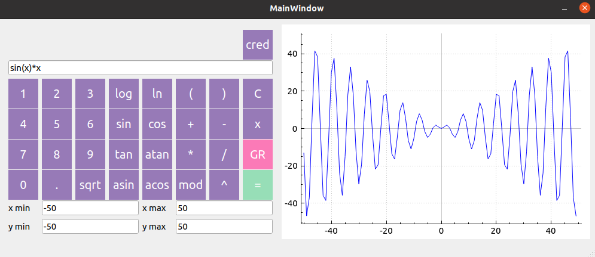
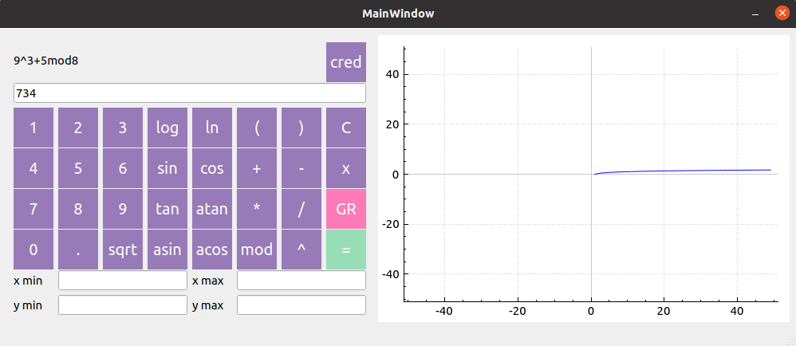

# Calculator
- Stack `C` `Qt6`


## Description
Калькулятор с возможностью построения графиков функций. Для вычисления выражения используются два стека, которые определяют порядок операций находящихся в выражении.


- График функции 



- График функции


- Вычисление значения выражения


- Вычисление начения выражения


## to run

- запустить тесты
```
make -f Makefile2 tests
```
- получить отсчёт о тестах в виде html-страницы
```
make -f Makefile2 gcov_report
```
- установить приложение калькулятора
```
make -f Makefile2 install
```
- запустить приложение калькулятора
```
make -f Makefile2 run
```
- удалить все созданные файлы
```
make -f Makefile2 clean
```


